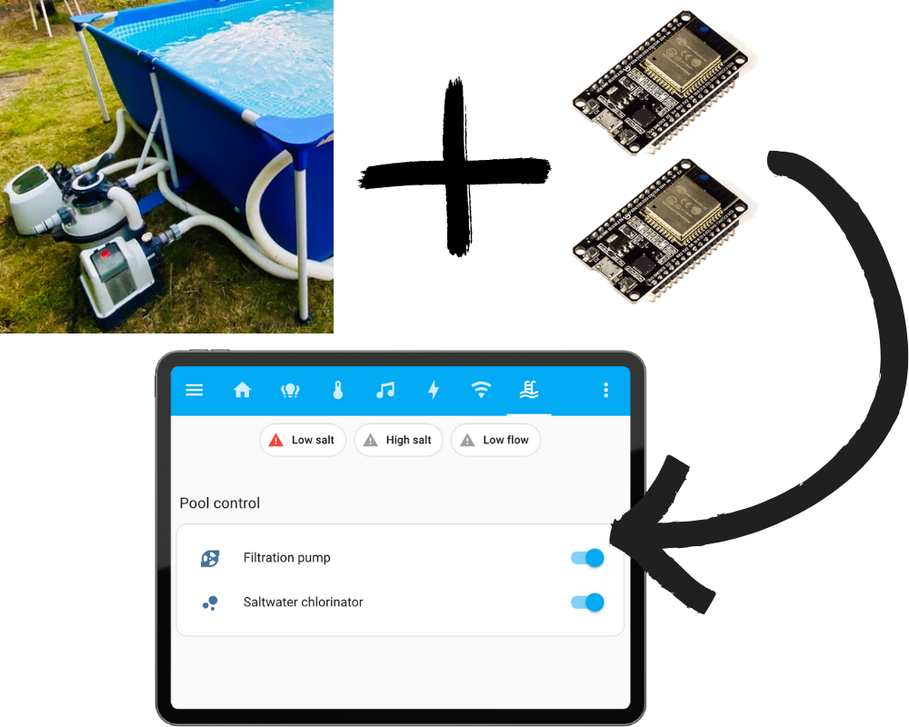

# ESPHome firmware for Intex pool filtration systems

This repository contains firmware which allows remotely controlling certain types of Intex
pool filtration pumps and saltwater chlorinators. The firmware is intended to be used on
an ESP32 board, which needs to be added as a modification to these devices.

The firmware is based on [ESPHome](https://esphome.io), which is a platform for
microcontrollers which enables all kinds of devices to be connected to Home Assistant to
automate them.

At this point it is still a work in progress. If you want to more know about this, you can
read [my series of blog posts about it](https://www.danielschenk.tech/swimming-pool/hacking-pool-1).
